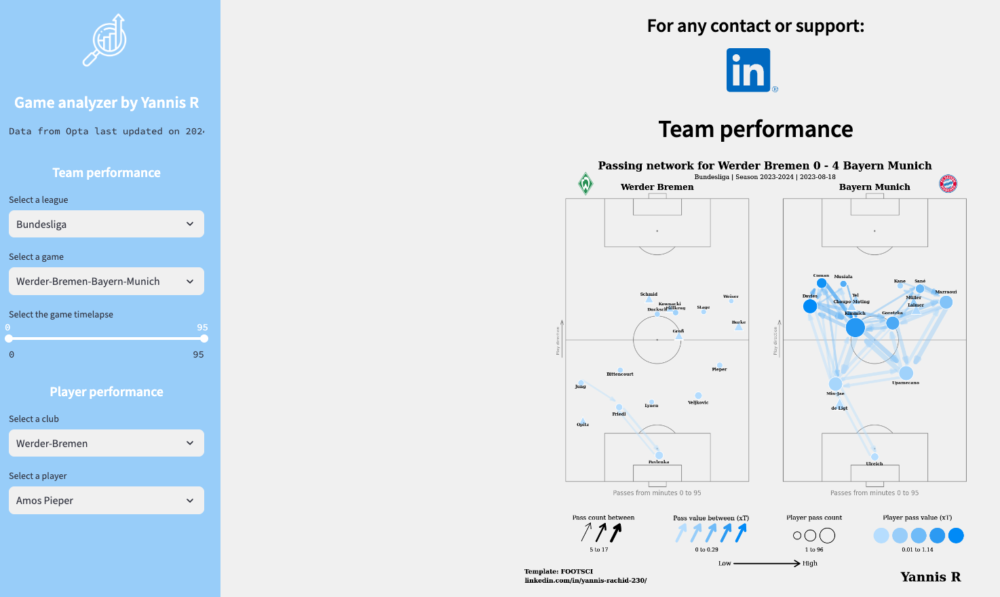
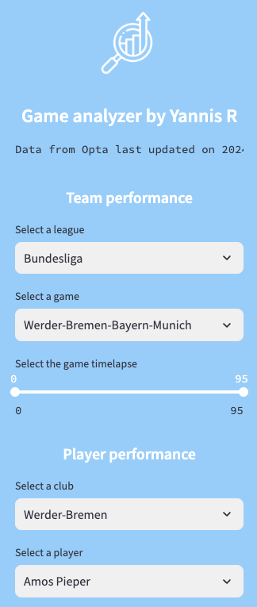
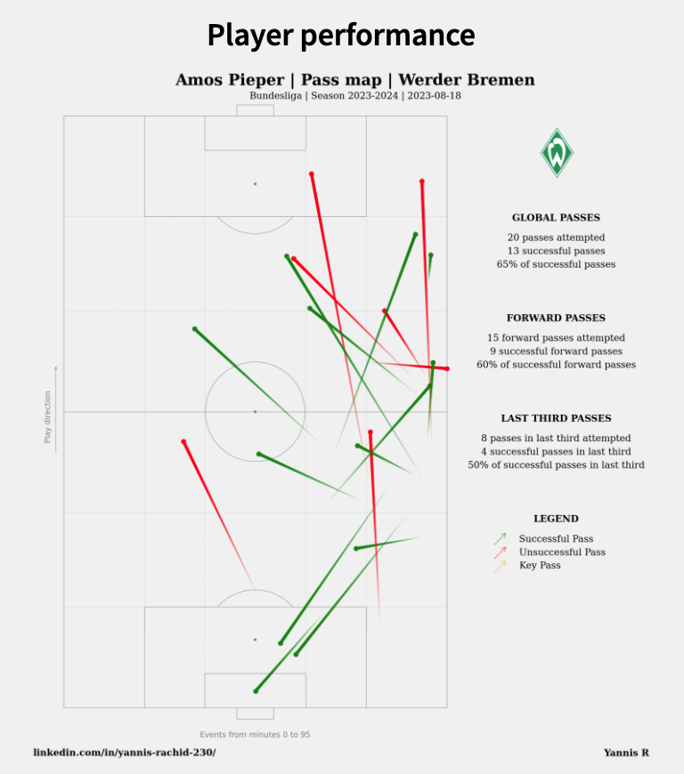
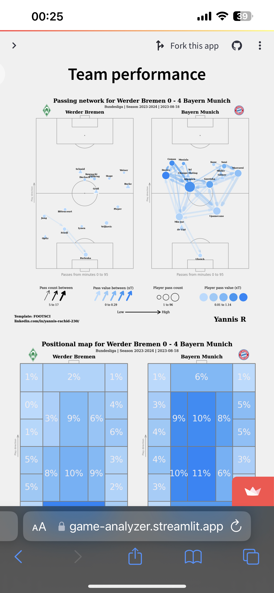

# Game Analyzer

Link to the App => [Streamlit App](https://game-analyzer.streamlitapp.com)
Developed by Yannis Rachid => [LinkedIn profile](https://www.linkedin.com/in/yannis-rachid-230/)

Game Analyzer is a streamlit web application which analyzes a selected game for the 2023/2024 season. The analysis is focused on the team performance and the player performance, providing data visualisations.
I have scraped the Opta events data on Whoscored.com. Theses files are stored as csv files in my S3 bucket.
Actually, we have the data for theses leagues, on 2024-03-22:

- Bundesliga
- Eredivisie
- Jupiler Pro League
- La Liga
- Liga Nos
- Ligue 1
- Premier League
- Serie A

The scraping module is not include in the repository. The data is refreshed on a weekly basis, each Tuesday (during the Championship weeks).
The code deployed on Streamlit is on the master branch.

These are the data visualisations:

| Performance analysis | Data visualisations |
| ----------- | ----------- |
| Team | <li>Passing Network</li><li>Positional Map</li> |
| Player | <li>Pass map</li><li>Heat map</li><li>Dribble map</li><li>Shot map</li><li>Defensive map</li> |

## Demo

Here is a working live [demo](img/app_demo.mov)

## App

#### Main page

#### Filters

#### Data visualisations

#### Mobile support
To display/undisplay the filters, please click on the little arrow in the top-left corner of your screen.

## Usage
#### Development
Want to contribute? Great!

To fix a bug or enhance an existing module, please follow these steps:

- Fork the repository
- Create a new branch from master: $ git checkout -b feature/{improvement}
- Make the appropriate changes in the files
- Add changes to reflect the changes made
- Commit your changes (git commit -am 'Improve feature')
- Push to the branch (git push origin improve-feature)
- Create a Pull Request on the develop branch

#### Bug / Feature Request
If you find a bug (the website couldn't handle the query and / or gave undesired results), kindly open an issue [here](https://github.com/yannisrachid/game_analyzer/issues/new) by including your search query and the expected result.

If you'd like to request a new functionnality, feel free to do so by opening an issue [here](https://github.com/yannisrachid/game_analyzer/issues/new). Please include sample queries and their corresponding results.

#### Built with
- Python
- AWS S3
- Opta Data from Whoscored

#### To do
- Add more leagues
- Add new data visualisations

#### Acknowledgements / References
- [@FOOTSCI](https://github.com/hadjdeh/football-data-analysis/tree/main/Pass_map): Passing network inspiration code and template
- [ScraperFC](https://github.com/oseymour/ScraperFC/tree/main/ScraperFC): Python package for data scraping
- [mplsoccer](https://mplsoccer.readthedocs.io/en/latest/): Python package for generating data visualisations
- [Football-Logos](https://github.com/luukhopman/football-logos): GitHub repository with the logos of all the clubs